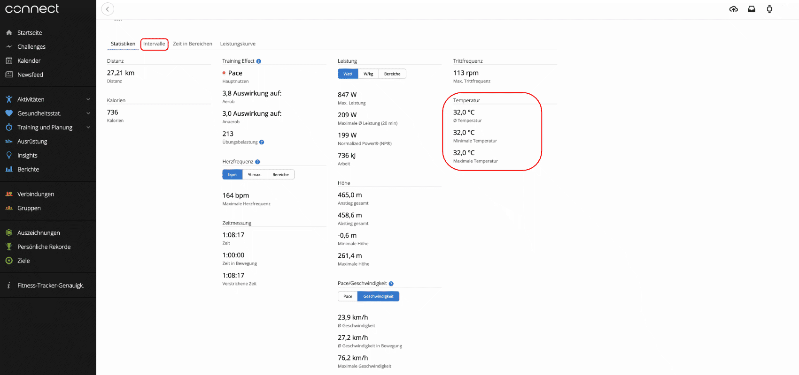
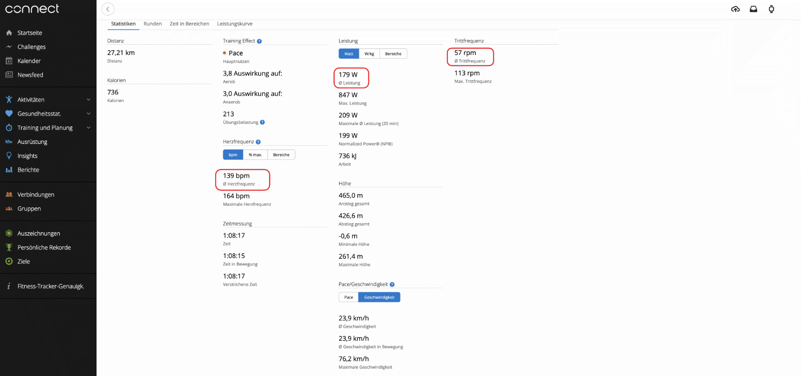

# mw2gc
Improve MyWhoosh activity files for Garmin Connect upload

### Usage

- Download `.dms` file(s) from MyWhoosh https://event.mywhoosh.com/user/activities

- Convert:

        $ python -m venv .venv
        $ . .venv/bin/activate
        $ pip install -r requirements.txt
        $ python mw2gc.py AxO8Yzq12bpL9MAST0R8f8HjmJUkNnWztEkCrap2.dms
        $ ls
        AxO8Yzq12bpL9MAST0R8f8HjmJUkNnWztEkCrap2.dms AxO8Yzq12bpL9MAST0R8f8HjmJUkNnWztEkCrap2.fit

- Upload `.fit` file(s) to Garmin Connnct https://connect.garmin.com/modern/import-data

.dms | .fit
---|---
|
